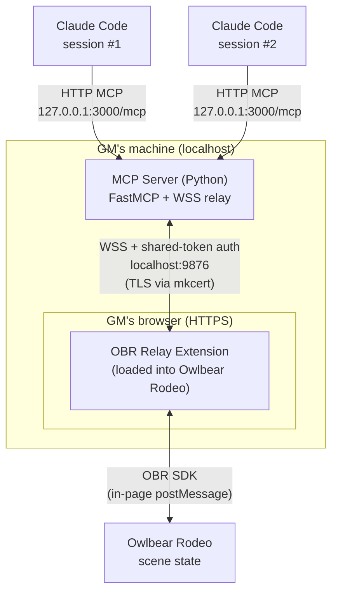

# OBR MCP Bridge

An MCP server that allows Claude to read and manipulate Owlbear Rodeo scenes via a relay extension running in the GM's browser.

## Architecture



**Networking notes:**

- **MCP transport** — Claude Code talks to the server over plain HTTP on `127.0.0.1:3000` using the streamable-HTTP MCP transport. Multiple sessions can connect concurrently.
- **WSS relay** — The server hosts a WebSocket Secure endpoint on `localhost:9876`. TLS is required because OBR runs over HTTPS and browsers block mixed-content (`ws://`) connections from secure pages. Certificates are issued locally via `mkcert`.
- **Authentication** — The extension presents a shared secret (`OBR_MCP_TOKEN`) on connect. The server enforces it before accepting messages.
- **Direction of traffic** — Claude → Server requests are pushed down the WSS channel to the extension, which executes them against the OBR SDK and returns results back over the same socket. The relay limits in-flight requests to 3 with a 10s per-request timeout.
- **Resilience** — The extension reconnects with exponential backoff if the socket drops, and persists credentials in `localStorage` to survive page reloads.

The extension is a thin relay — it executes OBR SDK calls and returns results. All game logic lives in the MCP server.

## Components

### MCP Server (`server/`)

Python server using the `mcp` SDK with streamable HTTP transport. Exposes an MCP endpoint on `localhost:3000/mcp` and runs a WSS server on `localhost:9876` that the relay extension connects to.

### OBR Relay Extension (`extension/`)

TypeScript/Vite browser extension loaded into Owlbear Rodeo. Connects to the local WSS server, authenticates with a shared token, and proxies SDK calls. The extension UI is only rendered for the GM — players see an empty popover.

A pre-built copy is hosted on GitHub Pages at `https://abottchen.github.io/obr-mcp-proxy/manifest.json`, so non-developers can install the extension without running the Vite dev server. Local development still uses `https://localhost:5173/manifest.json`.

## Setup

### Prerequisites

- Python 3.11+
- Node.js 18+
- [mkcert](https://github.com/FiloSottile/mkcert) for TLS certificates

### TLS Certificates

Required because OBR runs over HTTPS and browsers block mixed content (plain `ws://` from an HTTPS page).

```bash
mkcert -install
mkcert -cert-file server/certs/localhost.pem -key-file server/certs/localhost-key.pem localhost 127.0.0.1
```

If using Firefox, you may need to accept the certificate by navigating to `https://localhost:9876` and `https://localhost:5173` before connecting.

### Environment

Copy `.env.example` to `.env` and set a shared secret token:

```bash
cp .env.example .env
# Edit .env to set OBR_MCP_TOKEN
```

Optional port overrides:
- `OBR_MCP_PORT` — WSS relay port (default: 9876)
- `OBR_MCP_HTTP_PORT` — HTTP MCP server port (default: 3000)

### Install Dependencies

```bash
# Extension
cd extension && npm install

# MCP Server
cd server && pip install -e .
```

### MCP Configuration

The `.mcp.json` in the project root points Claude Code at the running MCP server:

```json
{
  "mcpServers": {
    "obr-mcp-server": {
      "type": "http",
      "url": "http://127.0.0.1:3001/mcp"
    }
  }
}
```

The default HTTP MCP port is `3000`. The example above uses `3001` to match the committed `.mcp.json`; if you stick with the default, also set `OBR_MCP_HTTP_PORT=3001` in `.env` (or change the URL to `:3000`).

## Usage

1. Start the MCP server (runs both the HTTP MCP endpoint and the WSS relay):
   ```bash
   cd server && python -m server.main
   ```

2. Start the extension dev server:
   ```bash
   cd extension && npx vite
   ```

3. In Owlbear Rodeo, add a custom extension using `https://localhost:5173/manifest.json`

4. Open the MCP Relay extension in OBR, enter `wss://localhost:9876` and your token, click Connect. Credentials are saved to localStorage — the extension will auto-reconnect on page refresh and after connection drops.

5. Claude Code will connect to the MCP server when it loads the `.mcp.json` config. Multiple Claude Code sessions can connect simultaneously.

## MCP Tools

### Read-only

| Tool | Description |
|------|-------------|
| `get_items` | List scene items with optional filtering by layer or name |
| `get_item` | Get a single item by ID or name |
| `get_metadata` | Get scene-level metadata |
| `get_item_metadata` | Get metadata for a specific item, with optional field filtering |
| `list_metadata_keys` | List available metadata keys on an item |
| `get_players` | Get connected players |
| `get_player_metadata` | Get current player's metadata |
| `get_room_metadata` | Get room-level metadata (persists across scenes) |
| `get_grid` | Get grid settings (DPI, scale, type, measurement) |
| `find_items_near` | Find items within a radius of a point or item, with distances |
| `get_distance_between` | Get grid-accurate distance between two items (respects measurement mode) |

### Scene Manipulation

All mutation tools require item UUIDs. Use read tools to find IDs first.

| Tool | Description |
|------|-------------|
| `update_item` | Update item properties via arbitrary fields dict |
| `update_item_metadata` | Merge metadata on an item |
| `update_scene_metadata` | Merge scene-level metadata |
| `update_room_metadata` | Merge room-level metadata (persists across scenes) |
| `add_item` | Place a new item (IMAGE, SHAPE, TEXT, LABEL, LINE, CURVE, PATH) |
| `delete_item` | Remove an item from the scene |

### Movement

| Tool | Description |
|------|-------------|
| `move_item` | Move to absolute pixel position with optional grid snap |

### Combat

| Tool | Description |
|------|-------------|
| `roll_dice` | Roll dice with D&D notation (e.g. 2d6+3), supports advantage/disadvantage |

### Rumble Integration

| Tool | Description |
|------|-------------|
| `send_chat` | Post a message to Rumble's shared chat log |
