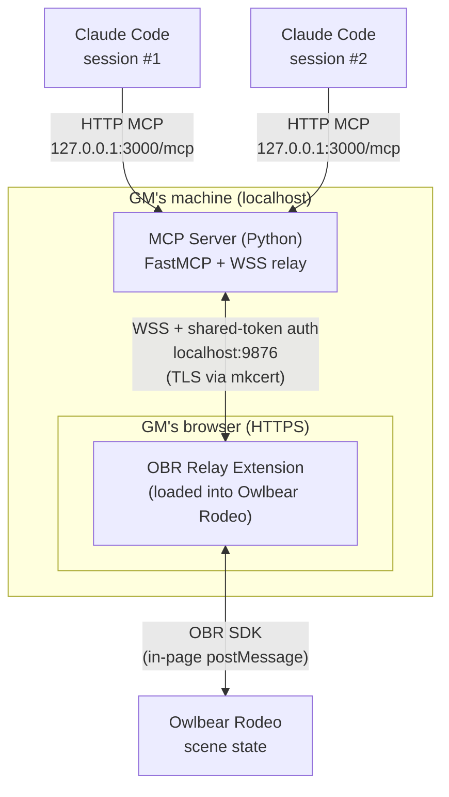

# OBR MCP Bridge

An MCP server that allows Claude to read and manipulate Owlbear Rodeo scenes via a relay extension running in the GM's browser.

## Architecture


```mermaid
flowchart TD
    C1["Claude Code<br/>session #1"]
    C2["Claude Code<br/>session #2"]

    subgraph Local["GM's machine (localhost)"]
        direction TB
        Server["MCP Server (Python)<br/>FastMCP + WSS relay"]
        subgraph Browser["GM's browser (HTTPS)"]
            Ext["OBR Relay Extension<br/>(loaded into Owlbear Rodeo)"]
        end
    end

    OBR["Owlbear Rodeo<br/>scene state"]

    C1 -->|"HTTP MCP<br/>127.0.0.1:3000/mcp"| Server
    C2 -->|"HTTP MCP<br/>127.0.0.1:3000/mcp"| Server
    Server <-->|"WSS + shared-token auth<br/>localhost:9876<br/>(TLS via mkcert)"| Ext
    Ext <-->|"OBR SDK<br/>(in-page postMessage)"| OBR
```

**Networking notes:**

- **MCP transport** — Claude Code talks to the server over plain HTTP on `127.0.0.1:3000` using the streamable-HTTP MCP transport. Multiple sessions can connect concurrently.
- **WSS relay** — The server hosts a WebSocket Secure endpoint on `localhost:9876`. TLS is required because OBR runs over HTTPS and browsers block mixed-content (`ws://`) connections from secure pages. Certificates are issued locally via `mkcert`.
- **Authentication** — The extension presents a shared secret (`OBR_MCP_TOKEN`) on connect. The server enforces it before accepting messages.
- **Direction of traffic** — Claude → Server requests are pushed down the WSS channel to the extension, which executes them against the OBR SDK and returns results back over the same socket. The relay limits in-flight requests to 3 with a 10s per-request timeout.
- **Resilience** — The extension reconnects with exponential backoff if the socket drops, and persists credentials in `localStorage` to survive page reloads.

The extension is a thin relay — it executes OBR SDK calls and returns results. All game logic lives in the MCP server.

## Components

### MCP Server (`server/`)

Python server using the `mcp` SDK with streamable HTTP transport. Exposes an MCP endpoint on `localhost:3000/mcp` and runs a WSS server on `localhost:9876` that the relay extension connects to.

### OBR Relay Extension (`extension/`)

TypeScript/Vite browser extension loaded into Owlbear Rodeo. Connects to the local WSS server, authenticates with a shared token, and proxies SDK calls. The extension UI is only rendered for the GM — players see an empty popover.

A pre-built copy is hosted on GitHub Pages at `https://abottchen.github.io/obr-mcp-proxy/manifest.json`, so non-developers can install the extension without running the Vite dev server. Local development still uses `https://localhost:5173/manifest.json`.

## Setup

### Prerequisites

- Python 3.11+
- Node.js 18+
- [mkcert](https://github.com/FiloSottile/mkcert) for TLS certificates

### TLS Certificates

Required because OBR runs over HTTPS and browsers block mixed content (plain `ws://` from an HTTPS page).

```bash
mkcert -install
mkcert -cert-file server/certs/localhost.pem -key-file server/certs/localhost-key.pem localhost 127.0.0.1
```

If using Firefox, you may need to accept the certificate by navigating to `https://127.0.0.1:9876` and `https://localhost:5173` before connecting. Certificate exceptions are stored per-origin, so accept it for the exact host you connect to.

### Environment

Copy `.env.example` to `.env` and set a shared secret token:

```bash
cp .env.example .env
# Edit .env to set OBR_MCP_TOKEN
```

Optional overrides:
- `OBR_MCP_PORT` — WSS relay port (default: 9876)
- `OBR_MCP_HTTP_PORT` — HTTP MCP server port (default: 3000)
- `OBR_MCP_ALLOWED_ORIGINS` — comma-separated origins allowed to open a relay
  connection (default: `https://abottchen.github.io,https://localhost:5173`).
  Set this if you host the extension somewhere other than the published URL.

The relay rejects WebSocket handshakes from any other origin with `403`.
WebSocket handshakes are not subject to CORS, so without this check any page
the GM visits could open a socket to the relay; browsers cannot forge `Origin`,
which is what makes the check effective. Requests with no `Origin` header at all
are allowed, so non-browser clients still work — a web page cannot omit it.

### Install Dependencies

```bash
# Extension
cd extension && npm install

# MCP Server
cd server && pip install -e .
```

### MCP Configuration

The `.mcp.json` in the project root points Claude Code at the running MCP server:

```json
{
  "mcpServers": {
    "obr-mcp-server": {
      "type": "http",
      "url": "http://127.0.0.1:3001/mcp"
    }
  }
}
```

The default HTTP MCP port is `3000`. The example above uses `3001` to match the committed `.mcp.json`; if you stick with the default, also set `OBR_MCP_HTTP_PORT=3001` in `.env` (or change the URL to `:3000`).

## Usage

1. Start the MCP server (runs both the HTTP MCP endpoint and the WSS relay):
   ```bash
   cd server && python -m server.main
   ```

2. In Owlbear Rodeo, add a custom extension. Two options:
   - **Hosted (recommended):** `https://abottchen.github.io/obr-mcp-proxy/manifest.json` — uses the Pages-hosted build, no local dev server needed.
   - **Local dev:** `https://localhost:5173/manifest.json` — requires the vite dev server to be running. Use this only when modifying the extension itself:
     ```bash
     cd extension && npx vite
     ```

   The extension UI is gated to the GM role; non-GM players who load the extension will see a notice that it is GM-only.

3. Open the MCP Relay extension in OBR, enter `wss://127.0.0.1:9876` and your token, click Connect. Credentials are saved to localStorage — the extension will auto-reconnect on page refresh and after connection drops.

4. Claude Code will connect to the MCP server when it loads the `.mcp.json` config. Multiple Claude Code sessions can connect simultaneously.

### Troubleshooting: `NS_ERROR_LOCAL_NETWORK_ACCESS_DENIED`

**Cause.** Firefox 154 (released 2026-08-18) extended Local Network Access
protections to WebSockets. From the release notes:

> Firefox's Local Network Access protections now extend to WebSocket
> connections. Websites that try to open a WebSocket to a device on the local
> network will now ask for permission first.

LNA shipped in Firefox 153, but WebSockets were exempt until 154 — which is why
this relay worked right up until that update and then stopped. The relay UI runs
as a cross-origin iframe (`https://abottchen.github.io`) inside
`https://www.owlbear.rodeo`, so its `wss://localhost:9876` connection is an
internet-origin page reaching loopback: exactly what LNA now blocks.

**Symptom.** A generic `Firefox can't establish a connection to the server at
wss://localhost:9876/`, which resembles a TLS, firewall, or certificate fault
but is none of those. Confirm via `NS_ERROR_LOCAL_NETWORK_ACCESS_DENIED` in the
console, or a HAR export showing the `wss://` request with `status=0` and
`time=0` while the server logs nothing — the request never leaves the browser.

**Fix.** In `about:config`, set the String pref (create it if absent):

```
network.lna.skip-domains = localhost,abottchen.github.io
```

`SkipDomains` matches *both* source and target domains: listing a source lets
that site reach local resources, listing a target lets all sites reach that
resource. Entries are bare hostnames and support a `*.` suffix wildcard.
Restart Firefox after changing it.

If that still does not take, `network.lna.enabled = false` disables LNA outright
(and also clears `network.lna.blocking` and `network.lna.block_trackers`). It
works, but it drops the protection for *all* browsing — prefer scoping it to a
dedicated Firefox profile (`firefox -P`) used only for the VTT.

Managed deployments can use the `LocalNetworkAccess` enterprise policy, which
exposes `SkipDomains`, `BlockTrackers`, and `EnablePrompting`.

**Isolating the server from the browser.** Open `https://localhost:9876`
directly in a tab. Seeing

```
Failed to open a WebSocket connection: invalid Connection header: keep-alive.
You cannot access a WebSocket server directly with a browser.
```

means TCP, TLS, and certificate trust are all fine — top-level navigations are
exempt from LNA, so only the page-level block remains.

### Scene Export / Import

Once connected, the extension UI exposes two buttons:

- **Export Scene** — downloads a JSON file containing all scene items, scene metadata, and room metadata. The filename is derived from the lowest-zIndex `MAP` image in the scene.
- **Import Scene** — loads a previously exported JSON file. Deletes all existing items in the current scene, then restores items and scene metadata from the file. Room metadata is only restored if the "Include room metadata on import" checkbox is ticked.

Export/import runs entirely in the extension — it does not go through the MCP server.

## MCP Tools

### Read-only

| Tool | Description |
|------|-------------|
| `get_items` | List scene items with optional filtering by layer or name |
| `get_item` | Get a single item by ID or name |
| `get_metadata` | Get scene-level metadata |
| `get_item_metadata` | Get metadata for a specific item, with optional field filtering |
| `list_metadata_keys` | List available metadata keys on an item |
| `get_players` | Get connected players |
| `get_player_metadata` | Get current player's metadata |
| `get_room_metadata` | Get room-level metadata (persists across scenes) |
| `get_grid` | Get grid settings (DPI, scale, type, measurement) |
| `find_items_near` | Find items within a radius of a point or item, with distances |
| `get_distance_between` | Get grid-accurate distance between two items (respects measurement mode) |

### Scene Manipulation

All mutation tools require item UUIDs. Use read tools to find IDs first.

| Tool | Description |
|------|-------------|
| `update_item` | Update item properties via arbitrary fields dict |
| `update_item_metadata` | Merge metadata on an item |
| `update_scene_metadata` | Merge scene-level metadata |
| `update_room_metadata` | Merge room-level metadata (persists across scenes) |
| `add_item` | Place a new item (IMAGE, SHAPE, TEXT, LABEL, LINE, CURVE, PATH) |
| `delete_item` | Remove an item from the scene |

### Movement

| Tool | Description |
|------|-------------|
| `move_item` | Move to absolute pixel position with optional grid snap |

### Combat

| Tool | Description |
|------|-------------|
| `roll_dice` | Roll dice in the dicex 3D tray (e.g. `2d6+3`; advantage `2d20kh1`, keep/drop, exploding) and return the result |
| `roll_dice_batch` | Roll a list of notations in one call (rolled serially); returns per-notation results, bad notations reported inline |

### Rumble Integration

| Tool | Description |
|------|-------------|
| `send_chat` | Post a message to Rumble's shared chat log |
